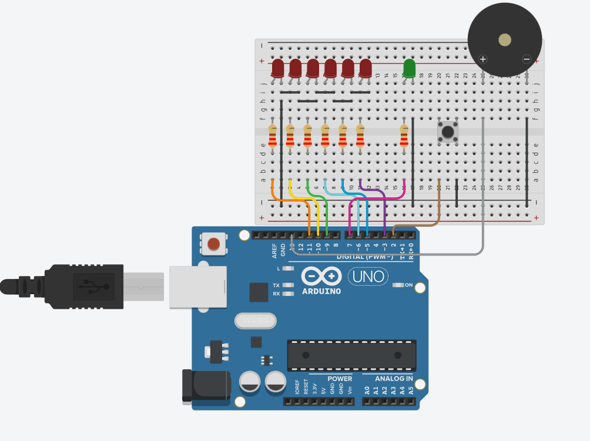

##ChargePulse – 6x LED System ( Non-critical )

##DETAILS
- Use an Arduino to control a Charge -> Hold -> Pulse LED system
- Hold the button to charge LEDs gradually
- When fully charged, LEDs stay at maximum brightness. The State LED will light up and Buzzer will beep to mark it.
- Press the button again to release ( pulse ) and turn off LEDs
- This project is made for learning, but it creates a new problem, what if we need 10 LEDs? When only have 6, that will be solved in the future.

##HARDWARE
- Arduino Uno 
- USB Cable ( 5V Source )
- 7 LEDs ( 6 in same color )
- 7 x 220Ω Resistors
- Pushbutton
- Breadboard
- Buzzer
- Jumper Wires

##DIAGRAMS

##REAL-LIFE CIRCUITS

##EXPLANATION
- In '.ino' files, I've added comments for you guys.
